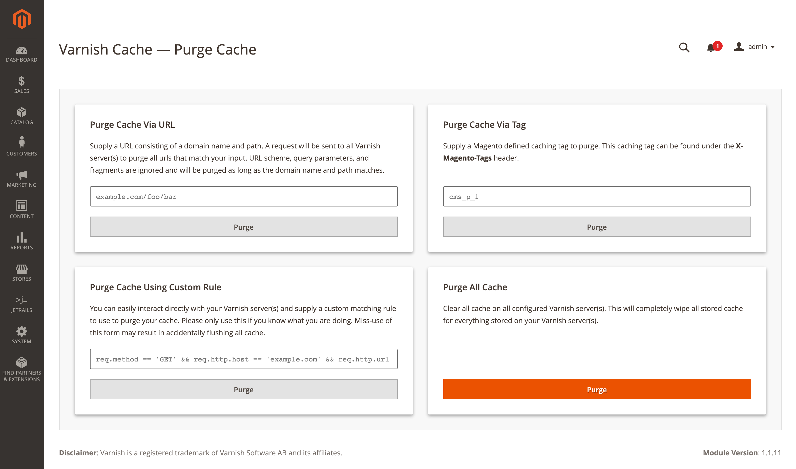

# Magento 2 - Varnish
> Magento 2 extension which interfaces with the Varnish® caching application in order to manage it through the Magento backend.

	

## About

This module helps manage varnish Cache™ for your Magento 2 store.  It supports a multiple varnish server configuration.  Purge requests can be sent to all these servers in order to purge a specific URL, a whole store view, or simply to purge all the cache that is contained in said varnish server. Additionally, the purge process can be executed automatically on product or CMS page save. Cache exclusion rules can be set to not cache paths or Magento routes. Finally, there exists a _debug_ mode that will display if Varnish FPC was used in loading the page and which exclusion rules should be blamed if the page is excluded.

## Documentation

The user manual can be found [here](https://learn.jetrails.com/article/magento-2-varnish-extension). The information there goes over all the features that the extension offers. It also takes you through the installation and configuration process of setting this extension up.

## Build System

All JetRails® modules use __Grunt__ as a build system.  Grunt is a package that can be easily downloaded using __NPM__.  Once this repository is cloned, run `npm install grunt -g` followed by `npm install` to install Grunt and all Grunt modules used within this build system.  Please refer to the following table for a description of some useful grunt build commands. A typical grunt command takes the following form: `grunt task:argument`.

| Task       | Description                                                                                                                                                                                     |
|------------|-------------------------------------------------------------------------------------------------------------------------------------------------------------------------------------------------|
| `bump`  | Updates the version number in all __php__ and __xml__ files with the one defined in __package.json__.                                                                                           |
| `package`  | This command first runs __init__ and then __resolve__.  It then compresses the source and dependencies and outputs the archive in __dist__.  This command gets the repo ready for a git commit. |
| `deploy`   | Will upload dependencies and source code to a staging server.  Credentials to this server can be configured in the __package.json__ file under the _staging_ attribute.                         |
| `watch`    | Will watch the __src__ folder for any changes. Once a change occurs it will run the __deploy__ task.                                                                               |
|            | The default task is aliased to run the __release__ task.                                                                                                                                        |

## Docker Environment

This project comes with a [docker-compose.yml](docker-compose.yml) file as well as a [docker-sync.yml](docker-sync.yml) file, which can be used to spin up a Magento 2 environment. In order to use docker, please make sure you have **Docker**, **Docker Compose**, and **Docker Sync** installed. For information about configuring this docker environment, please refer to it's Github repository which can be found [here](https://github.com/jetrails/docker-magento-alpine).

## Legal Disclaimer

Varnish is a registered trademark of Varnish Software AB and its affiliates.
